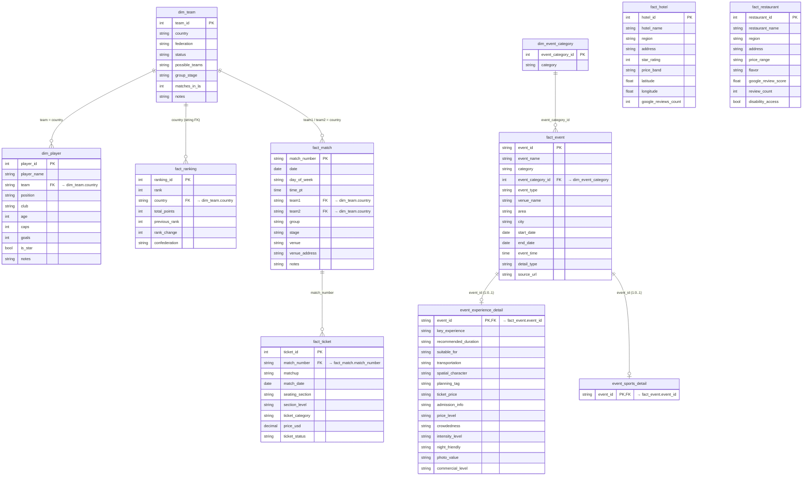

# ER Diagram — derived from `backend/queries.py`

Reverse-engineered from every `SELECT` and `JOIN` in [`backend/queries.py`](../../backend/queries.py).
Renders natively on GitHub via Mermaid.

> 简体中文：see relationship summary at the bottom.

---

## Diagram

---

## Relationship summary

| From → To | Cardinality | Join key | Source |
|---|---|---|---|
| `dim_team` → `dim_player` | 1 : N | `dim_team.country = dim_player.team` | `get_players_by_team()` |
| `dim_team` → `fact_match` | 1 : N (twice) | `dim_team.country = fact_match.team1 / team2` | `fact_match` schema |
| `dim_team` → `fact_ranking` | 1 : 0..1 | `country` (no enforced FK; matched by string) | `get_all_rankings()` |
| `dim_event_category` → `fact_event` | 1 : N | `event_category_id` | `LEFT JOIN` in `get_all_events()` / `get_events_by_categories()` |
| `fact_match` → `fact_ticket` | 1 : N | `match_number` | `get_tickets_by_match()` |
| `fact_event` → `event_experience_detail` | 1 : 0..1 | `event_id` | `LEFT JOIN` in `get_events_by_categories()` and `get_event_detail()` |
| `fact_event` → `event_sports_detail` | 1 : 0..1 | `event_id` | `get_event_detail()` |

**Standalone tables** (no relationships referenced in `queries.py`):
- `fact_hotel`
- `fact_restaurant`

These two are queried independently for Explore LA browsing and Journey budget recommendations; their relevance to a match / venue is computed at runtime by area string matching, not by a database FK.

---

## Notes on enforcement

- `dim_team`-related joins use **country name strings**, not surrogate IDs. The schema treats country as the natural key — but there's no DB-enforced foreign key (which is why `_with_latest_team_data()` in `queries.py` has to splice in renames for confirmed playoff winners after the fact).
- `event_id` on the two detail tables is treated as both PK and FK (one row per event at most).
- `event_category_id` is stored as `text` in `fact_event` (note the `::int` cast in `get_events_by_categories()`).

---

## Tables documented in the README but not referenced by `queries.py`

The main README mentions three additional tables that exist in the schema but aren't queried by the current backend:
- `dim_place` — stadiums, airports, transport places
- `dim_mode` — transport mode metadata
- `fact_route` — airport-to-venue and local routes

They aren't drawn above because no SQL in `queries.py` touches them. If/when a route-planning endpoint is added, this diagram should be updated.
